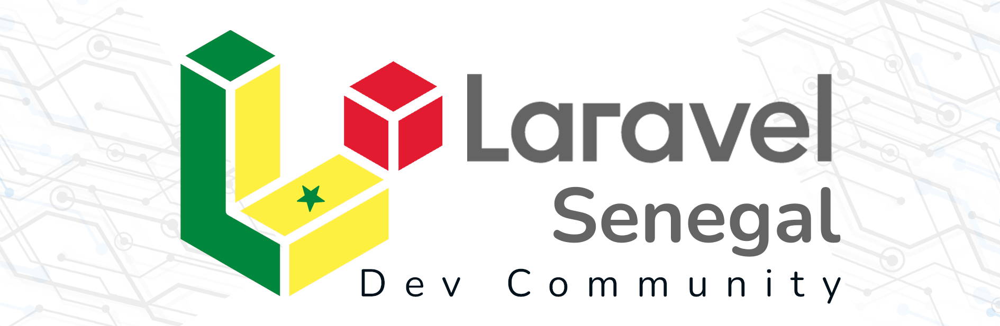

<p align="center"><a href="https://laravel.com" target="_blank">
</a>
</p>

<p align="center">
<a href="https://github.com/laravel/framework/actions">
    
</a>
<!-- <a href="https://packagist.org/packages/laravel/framework">
    
</a> -->
<a href="https://packagist.org/packages/laravel/framework">
    
</a>
<a href="https://packagist.org/packages/laravel/framework">
    
</a>
</p>

# laravelSN-community

## Brève Description

Laravel SN Community s'inscrit dans la vision de la communauté Laravel SN, cherchant à promouvoir l'utilisation de Laravel et Livewire dans le développement web au Sénégal. Nous sommes un groupe passionné de développeurs, d'experts Laravel, et d'enthousiastes technologiques, réunis pour partager des connaissances, construire des projets collaboratifs,Innovation, réseautage et apprentissage continu.

### But du Projet

Le but est de créer une plateforme collaborative pour les développeurs Laravel au Sénégal, encourager l'adoption de Laravel dans des projets locaux.

### Utilité

-   **Communauté Collaborative** : Laravel SN community vise à créer une communauté collaborative où les développeurs Laravel au Sénégal peuvent échanger des idées, partager des connaissances et collaborer sur des projets.
-   **Promotion de Laravel** : Nous cherchons à promouvoir l'utilisation de Laravel comme un outil puissant dans le développement web au Sénégal.

## Principales Fonctionnalités

-   **Plateforme de Collaboration** : Laravel SN Community fournira une plateforme où les membres peuvent collaborer sur des projets open source, partager des ressources et discuter de sujets liés à Laravel et Livewire.
-   **Sessions de Formation** : Nous envisageons d'organiser des sessions de formation pour renforcer les compétences des membres, en particulier des jeunes développeurs, dans l'écosystème Laravel.

## Comment Contribuer

Nous encourageons activement la contribution de la communauté ! Si vous souhaitez participer, suivez ces étapes simples :

1. **Fork du Projet :** Cliquez sur le bouton "Fork" en haut à droite de cette page pour créer une copie du projet dans votre compte GitHub.

2. **Clonage du Projet :** Clonez votre fork sur votre machine locale en utilisant la commande `git clone`.

3. **Configuration de la Branche :** Créez une nouvelle branche pour vos modifications avec `git checkout -b nom-de-votre-branche`.

4. **Contributions :** Faites les modifications, ajoutez des fonctionnalités, résolvez des problèmes, et assurez-vous de suivre les meilleures pratiques de codage.

5. **Validation :** Testez vos modifications et assurez-vous qu'elles fonctionnent correctement.

6. **Soumission des Modifications :** Ajoutez, validez et poussez vos changements sur votre fork avec les commandes `git add`, `git commit`, et `git push`.

7. **Pull Request :** Créez une Pull Request vers la branche principale du projet original pour que nous puissions examiner vos modifications.

```bash
git clone https://github.com/weexduunx/laravelSN-theCommunity.git

```
